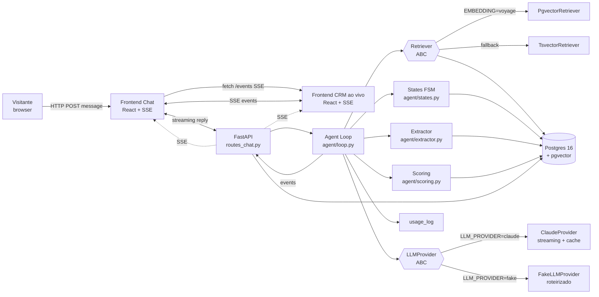

# Arquitetura — Atende AI

> Visão geral: como o agente, o RAG, o extractor, o score e o CRM ao vivo se encaixam.

## Diagrama de fluxo (mermaid)



## Componentes principais

### Backend

| Módulo | Responsabilidade |
|---|---|
| `app/main.py` | FastAPI app, CORS, startup (carrega prompt, valida env, abre pool) |
| `app/api/routes_chat.py` | `POST /api/sessions`, `POST /api/sessions/{id}/messages`, `GET /api/sessions/{id}/events` (SSE) |
| `app/api/routes_admin.py` | `/admin/login`, `/admin/conversas`, `/admin/leads`, `/admin/custos`, `/admin/agente` |
| `app/agent/loop.py` | Orquestra um turno: `retrieve → chat → extract → score → state → events` |
| `app/agent/extractor.py` | Tool use / JSON pra extrair `{name, service_interest, complaint, budget_range, urgency}` |
| `app/agent/scoring.py` | Função pura `score(lead_profile) -> {total: int, breakdown: dict}` |
| `app/agent/states.py` | FSM `novo → em_qualificacao → qualificado → agendamento_proposto → handoff` |
| `app/services/llm.py` | `LLMProvider` ABC + `ClaudeProvider` (streaming + cache_control) + `FakeLLMProvider` (roteirizado por estado) |
| `app/services/retriever.py` | `Retriever` ABC + `PgvectorRetriever` + `TsvectorRetriever` (fallback sem embeddings) |
| `app/services/budget.py` | Verifica `usage_log` agregado do dia; retorna `BudgetExceededError` se estourou |
| `app/services/rate_limit.py` | Middleware in-memory: 1 msg/2s por sessão, 5 sessões/IP/hora |
| `app/services/reset.py` | Job de reset diário (03h): apaga sessões > 24h, re-seed knowledge |
| `app/models/` | SQLAlchemy 2.0 async — `Session`, `Message`, `Lead`, `LeadEvent`, `KnowledgeChunk`, `UsageLog`, `AdminUser` |
| `app/seeds/knowledge/` | 12 arquivos `.md` da Clínica Renova (serviços, preços, FAQ, endereço, etc) |

### Frontend

| Módulo | Responsabilidade |
|---|---|
| `pages/Home.tsx` | Layout 2 colunas (chat \| CRM) — desktop; abas no mobile |
| `pages/Admin.tsx` | Painel admin com tabs: Conversas, Leads, Custos, Agente |
| `pages/ComoFunciona.tsx` | Diagrama + FAQ comercial |
| `components/chat/ChatWindow.tsx` | Bolhas, scroll, "digitando...", quick replies |
| `components/chat/MessageBubble.tsx` | Bolha individual + timestamp + check duplo |
| `components/crm/LeadCard.tsx` | Card com campos + micro-animação de highlight |
| `components/crm/ScoreBar.tsx` | Barra de progresso + breakdown expandível |
| `components/crm/Funnel.tsx` | Funil horizontal com estado atual aceso |
| `components/crm/Timeline.tsx` | Lista de eventos em ordem cronológica |
| `hooks/useSession.ts` | Cria sessão, mantém estado local de messages/lead/events |
| `hooks/useSSE.ts` | Conecta em `/api/sessions/{id}/events`, parseia eventos |
| `lib/api.ts` | Wrapper tipado sobre `fetch` (sem axios) |

---

## Fluxo de uma mensagem do visitante

```
1. Frontend POST /api/sessions/{id}/messages { content }
2. Middleware:
   - rate limit 1 msg/2s → 429 se violar
   - input length ≤ 500 chars → 400 se passar
   - session status != 'capped' → 410 se capped
   - budget global do dia → 503 + payload {"banner": "high_demand"} se estourou
3. Persistir Message(role=user) + incrementar message_count
4. Agent Loop:
   a. retrieve(top_k=3, query=message.content) → chunks RAG (se for pergunta)
   b. build prompt: system + lead_profile + history (janela 12) + RAG
   c. llm.chat_stream(prompt) → chunks de texto (SSE reply event)
   d. extractor.run(message + reply + history) → lead_profile_update
   e. scoring.compute(lead_profile) → { total, breakdown }
   f. states.transition(lead.state, signals) → novo estado
   g. persistir Message(role=agent), Lead atualizado, LeadEvents
   h. emitir SSE events: 'token' (vários), 'lead_update', 'score_update', 'state_update', 'timeline_event', 'done'
5. Frontend recebe SSE:
   - Chat: append tokens, mostra "digitando...", fecha typing no 'done'
   - CRM: atualiza card, score, funil, timeline em tempo real
```

## Guarda-corpos (7)

| # | Guarda-corpo | Onde |
|---|---|---|
| 1 | Cap 30 msgs/sessão | `routes_chat.py` + `states.py` (transição pra `capped`) |
| 2 | Rate limit 1 msg/2s + 5 sessões/IP/hora | `services/rate_limit.py` (middleware in-memory) |
| 3 | Budget diário global | `services/budget.py` (consulta `usage_log` agregado) |
| 4 | usage_log contábil | tabela + dashboard admin |
| 5 | Truncagem de histórico (janela 12) | `agent/loop.py` |
| 6 | Limite 500 chars de input | `routes_chat.py` |
| 7 | TTL 24h + reset 03h | `services/reset.py` + `docker-compose.yml` |

## SSE — eventos

| Evento | Payload | Frontend trata |
|---|---|---|
| `token` | `{delta: string}` | append no último token da Sofia |
| `typing` | `{active: bool}` | toggle indicador "digitando..." |
| `lead_update` | `{fields: {...}}` | atualiza card + highlight |
| `score_update` | `{total: int, breakdown: {...}}` | atualiza barra de score |
| `state_update` | `{from, to}` | acende nova etapa do funil |
| `timeline_event` | `{type, payload}` | append na timeline |
| `quick_replies` | `{options: [{id, label}]}` | renderiza botões |
| `done` | `{latency_ms, message_id}` | fecha typing + libera input |
| `error` | `{code, message}` | toast discreto |
| `banner` | `{type: 'high_demand', url}` | banner global "demo em alta demanda" |

## Decisões deliberadas

- **SSE em vez de WebSocket:** mais simples, atravessa proxy/Traefik sem header extra, suficiente pra 1 conexão por sessão.
- **FakeLLMProvider roteirizado por estado:** permite rodar offline (sem API key) e testar extração/score/CRM sem LLM.
- **Prompt versionado em arquivo:** muda prompt → bump versão → changelog → teste carregando do arquivo.
- **Extractor em paralelo ao chat:** segunda chamada leve (tool use / JSON) atualiza `lead_profile`. Custo aceitável em haiku.
- **Score determinístico em código:** auditável, sem "a IA decidiu que é 80". Vira argumento de venda.
- **RAG só quando parece pergunta:** keywords curtos ou score de similaridade alto. Não enche contexto à toa.

## Limites conhecidos (MVP)

- Não suporta áudio/imagem.
- Não tem fila de mensagens offline (modo claude sem internet → 503).
- Não tem multi-tenant (cada deploy = uma empresa).
- Admin não edita base RAG pela UI (precisa re-deploy ou rota extra).
- Sem webhook real de handoff — só registra na timeline.

Próximos passos em `CLAUDE.md`.